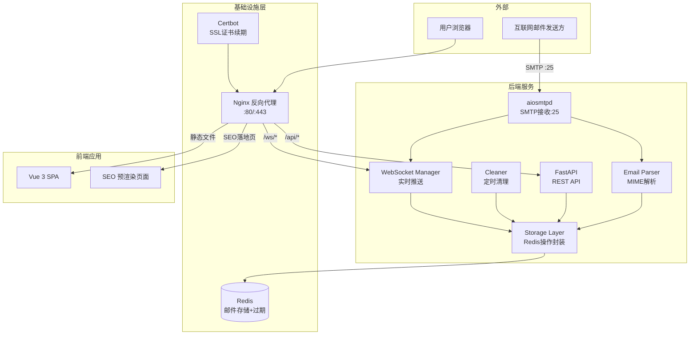

# L1-TASK-001 临时邮箱工具站 架构设计文档

## 1. 需求摘要

构建临时邮箱工具站，对标 Temp-Mail.org（46M月流量），提供一次性匿名邮箱服务。核心通过 Programmatic SEO 获取搜索流量。

**核心功能：**
- 一键生成临时邮箱地址，无需注册
- 实时接收邮件（WebSocket 推送）
- HTML 邮件安全渲染 + 附件下载
- 邮件自动过期清理（可配置保留时间）
- 中英文双语支持
- Programmatic SEO 落地页（每个域名/用途独立页面）

**硬约束：**
- 全部 Docker 容器化，禁止修改宿主机配置
- 后端 Python 3.11+ / asyncio，uv 管理依赖
- 前端 Vue 3 + TypeScript + Ant Design Vue 4，yarn 管理依赖
- 禁止硬编码敏感信息

## 2. 方案选择

### SMTP 接收方案对比

| 方案 | 项目参考 | 优点 | 缺点 | 适用场景 |
|------|----------|------|------|----------|
| **A. Cloudflare Email Worker 转发** | TempFastMail | 免费、无需暴露25端口、抗垃圾邮件 | 依赖第三方、延迟不可控、不支持多域名灵活切换 | 个人小站、域名已托管CF |
| **B. Postfix + Dovecot 传统栈** | disposable-mailbox-docker | 成熟稳定、功能完整、支持IMAP | 重量级、配置复杂、资源占用高、维护成本大 | 企业级邮件系统 |
| **C. 第三方 API 代理** | mehmetkahya0/temp-mail | 零后端、部署简单 | 完全依赖第三方、无法自定义域名、随时可能失效 | 纯前端演示 |
| **D. aiosmtpd 轻量自建（选定）** | 自研 | 纯Python异步、轻量、与后端同语言栈、易集成WebSocket | 需自行处理垃圾邮件过滤、需暴露25端口 | 自托管临时邮箱 |

### 选型结论：方案 D — aiosmtpd 轻量自建

**理由：**
1. **技术栈统一**：后端全 Python asyncio，SMTP 服务与 API 服务共享事件循环，无跨语言通信开销
2. **轻量可控**：aiosmtpd 单文件即可实现 SMTP 接收，对比 Postfix+Dovecot 减少 80% 配置
3. **实时性**：邮件到达即触发 WebSocket 推送，无轮询延迟
4. **Docker 友好**：单容器运行，无需编排多个邮件服务
5. **多域名支持**：代码层面 catch-all，支持任意域名邮件接收


## 3. 文件结构

```
temp-mail-tools/
├── backend/
│   ├── pyproject.toml              # uv 项目配置 + 依赖声明
│   ├── .env.example                # 环境变量模板
│   ├── app/
│   │   ├── __init__.py
│   │   ├── main.py                 # FastAPI 应用入口，挂载路由和WebSocket
│   │   ├── config.py               # 配置管理（从环境变量读取）
│   │   ├── smtp_server.py          # aiosmtpd SMTP 接收服务
│   │   ├── storage.py              # 邮件存储层（Redis 操作封装）
│   │   ├── cleaner.py              # 过期邮件定时清理任务
│   │   ├── ws_manager.py           # WebSocket 连接管理器
│   │   ├── models.py               # Pydantic 数据模型
│   │   ├── routers/
│   │   │   ├── __init__.py
│   │   │   ├── mailbox.py          # 邮箱生成/查询/删除 API
│   │   │   └── emails.py           # 邮件列表/详情/附件 API
│   │   └── utils/
│   │       ├── __init__.py
│   │       ├── email_parser.py     # 邮件解析（MIME、附件提取）
│   │       └── sanitizer.py        # HTML 邮件内容净化
│   └── tests/
│       ├── test_smtp.py
│       ├── test_api.py
│       └── test_storage.py
├── frontend/
│   ├── package.json
│   ├── vite.config.ts
│   ├── tsconfig.json
│   ├── index.html
│   ├── public/
│   │   └── robots.txt
│   └── src/
│       ├── main.ts                 # Vue 应用入口
│       ├── App.vue                 # 根组件
│       ├── router/
│       │   └── index.ts            # 路由配置
│       ├── stores/
│       │   ├── mailbox.ts          # 邮箱状态管理
│       │   └── locale.ts           # 语言切换状态
│       ├── composables/
│       │   ├── useWebSocket.ts     # WebSocket 连接 hook
│       │   └── useMailbox.ts       # 邮箱操作 hook
│       ├── components/
│       │   ├── layout/
│       │   │   ├── AppHeader.vue   # 顶部导航 + 语言切换 + 广告位
│       │   │   ├── AppSidebar.vue  # 侧边栏广告位
│       │   │   └── AppFooter.vue   # 底部 + 广告位
│       │   ├── mailbox/
│       │   │   ├── MailboxGenerator.vue  # 一键生成邮箱组件
│       │   │   ├── InboxList.vue         # 收件箱列表
│       │   │   └── EmailDetail.vue       # 邮件详情渲染
│       │   ├── ads/
│       │   │   └── AdSlot.vue      # 广告位通用组件
│       │   └── seo/
│       │       └── SeoHead.vue     # 动态 meta/OG/hreflang 组件
│       ├── views/
│       │   ├── HomeView.vue        # 首页
│       │   ├── InboxView.vue       # 收件箱页
│       │   ├── LandingView.vue     # SEO 落地页模板
│       │   └── NotFoundView.vue    # 404 页
│       ├── locales/
│       │   ├── zh-CN.json          # 中文语言包
│       │   └── en-US.json          # 英文语言包
│       └── types/
│           └── index.ts            # 全局类型定义
├── seo/
│   ├── generator.py                # 落地页数据生成脚本
│   ├── templates/                  # 落地页模板
│   │   └── landing.html.j2
│   ├── data/
│   │   ├── domains.json            # 支持的域名列表
│   │   └── use_cases.json          # 用途分类数据
│   └── output/                     # 生成的静态落地页（构建产物）
├── infra/
│   ├── docker-compose.yml          # 服务编排
│   ├── nginx/
│   │   └── nginx.conf              # Nginx 反向代理配置
│   ├── certbot/
│   │   └── cli.ini                 # Let's Encrypt 配置
│   └── redis/
│       └── redis.conf              # Redis 配置
├── design/                         # 设计文档目录
│   └── L1-TASK-001-architecture.md
└── README.md
```

## 4. 类型定义

### 后端 Python（Pydantic V2）

```python
"""backend/app/models.py — 数据模型定义"""
from __future__ import annotations

from datetime import datetime
from pydantic import BaseModel, Field


class Mailbox(BaseModel):
    """临时邮箱"""
    address: str = Field(description="完整邮箱地址，如 abc123@tempmail.dev")
    token: str = Field(description="访问令牌，用于查询该邮箱的邮件")
    created_at: datetime
    expires_at: datetime


class EmailAttachment(BaseModel):
    """邮件附件"""
    filename: str
    content_type: str
    size: int = Field(description="字节数")
    download_url: str = Field(alias="downloadUrl")


class EmailSummary(BaseModel):
    """邮件摘要（列表用）"""
    id: str
    from_addr: str = Field(alias="fromAddr")
    subject: str
    received_at: datetime = Field(alias="receivedAt")
    has_attachments: bool = Field(alias="hasAttachments")
    preview: str = Field(description="正文前100字符预览")


class EmailDetail(BaseModel):
    """邮件详情"""
    id: str
    from_addr: str = Field(alias="fromAddr")
    to_addr: str = Field(alias="toAddr")
    subject: str
    text_body: str | None = Field(None, alias="textBody")
    html_body: str | None = Field(None, alias="htmlBody", description="已净化的HTML")
    received_at: datetime = Field(alias="receivedAt")
    attachments: list[EmailAttachment] = []


class MailboxCreateResponse(BaseModel):
    """创建邮箱响应"""
    address: str
    token: str
    expires_at: datetime = Field(alias="expiresAt")


class WebSocketMessage(BaseModel):
    """WebSocket 推送消息"""
    type: str = Field(description="new_email | mailbox_expired")
    data: EmailSummary | None = None
```

### 前端 TypeScript

```typescript
// frontend/src/types/index.ts — 全局类型定义

export interface Mailbox {
  address: string
  token: string
  expiresAt: string // ISO 8601
}

export interface EmailAttachment {
  filename: string
  contentType: string
  size: number
  downloadUrl: string
}

export interface EmailSummary {
  id: string
  fromAddr: string
  subject: string
  receivedAt: string
  hasAttachments: boolean
  preview: string
}

export interface EmailDetail {
  id: string
  fromAddr: string
  toAddr: string
  subject: string
  textBody: string | null
  htmlBody: string | null
  receivedAt: string
  attachments: EmailAttachment[]
}

export interface WsMessage {
  type: 'new_email' | 'mailbox_expired'
  data?: EmailSummary
}
```

## 5. 外部接口

### REST API

| 方法 | 路径 | 请求体 | 响应体 | 说明 |
|------|------|--------|--------|------|
| POST | `/api/mailbox` | `{"domain": "tempmail.dev"}` (可选) | `MailboxCreateResponse` | 生成临时邮箱，返回地址和token |
| GET | `/api/mailbox/{token}` | — | `Mailbox` | 查询邮箱状态（是否过期） |
| DELETE | `/api/mailbox/{token}` | — | `{"ok": true}` | 删除邮箱及所有邮件 |
| GET | `/api/mailbox/{token}/emails` | Query: `page=1&size=20` | `{"items": EmailSummary[], "total": int}` | 获取邮件列表（分页） |
| GET | `/api/mailbox/{token}/emails/{email_id}` | — | `EmailDetail` | 获取邮件详情 |
| GET | `/api/mailbox/{token}/emails/{email_id}/attachments/{filename}` | — | 文件流 | 下载附件 |
| GET | `/api/sitemap.xml` | — | XML | 动态生成 sitemap |
| GET | `/api/seo/landing/{slug}` | — | JSON | 落地页数据（SSR用） |

### WebSocket

| 端点 | 协议 | 说明 |
|------|------|------|
| `ws://host/ws/{token}` | WebSocket | 连接后实时接收该邮箱的新邮件通知 |

**WebSocket 消息格式：**
- 服务端 → 客户端：`{"type": "new_email", "data": EmailSummary}`
- 服务端 → 客户端：`{"type": "mailbox_expired", "data": null}`
- 客户端 → 服务端：`{"type": "ping"}`（心跳保活）

### SMTP 接收

| 端口 | 协议 | 说明 |
|------|------|------|
| 25 | SMTP | aiosmtpd 监听，catch-all 接收所有域名邮件 |


## 6. 模块依赖（调用关系图）



**关键调用链：**
1. **邮件接收**：SMTP → Parser → Storage(Redis) → WebSocket → 浏览器
2. **邮件查询**：浏览器 → Nginx → API → Storage(Redis) → 响应
3. **SEO 访问**：搜索引擎 → Nginx → 预渲染静态页 / SSR 数据接口


## 7. 错误处理

| 场景 | HTTP 状态码 | 错误码 | 前端展示 |
|------|-------------|--------|----------|
| 邮箱 token 无效 | 404 | `MAILBOX_NOT_FOUND` | "邮箱不存在或已过期，请重新生成" |
| 邮箱已过期 | 410 | `MAILBOX_EXPIRED` | "邮箱已过期，请生成新邮箱" |
| 邮件不存在 | 404 | `EMAIL_NOT_FOUND` | "邮件不存在" |
| 附件不存在 | 404 | `ATTACHMENT_NOT_FOUND` | "附件不存在" |
| 请求频率超限 | 429 | `RATE_LIMITED` | "请求过于频繁，请稍后再试" |
| 服务内部错误 | 500 | `INTERNAL_ERROR` | "服务暂时不可用，请稍后重试" |
| WebSocket token 无效 | — | WS 关闭码 4001 | 自动断开，提示重新生成邮箱 |
| WebSocket 邮箱过期 | — | WS 关闭码 4002 | 提示邮箱已过期 |

**错误响应格式：**
```json
{
  "error": {
    "code": "MAILBOX_NOT_FOUND",
    "message": "邮箱不存在或已过期"
  }
}
```


## 8. 模块分配表

| 模块/文件 | 负责角色 | 层级 | 依赖 |
|-----------|----------|------|------|
| `backend/app/config.py` | 后端开发者 | L2 | 无 |
| `backend/app/models.py` | 后端开发者 | L2 | 无 |
| `backend/app/storage.py` | 后端开发者 | L2 | config, models |
| `backend/app/utils/email_parser.py` | 后端开发者 | L2 | models |
| `backend/app/utils/sanitizer.py` | 后端开发者 | L2 | 无 |
| `backend/app/smtp_server.py` | 后端开发者 | L2 | storage, email_parser, ws_manager |
| `backend/app/ws_manager.py` | 后端开发者 | L2 | models |
| `backend/app/routers/mailbox.py` | 后端开发者 | L2 | storage, models |
| `backend/app/routers/emails.py` | 后端开发者 | L2 | storage, models, sanitizer |
| `backend/app/cleaner.py` | 后端开发者 | L2 | storage, config |
| `backend/app/main.py` | 后端开发者 | L2 | 所有后端模块 |
| `backend/pyproject.toml` | 后端开发者 | L2 | 无 |
| `frontend/src/types/index.ts` | 前端开发者 | L2 | 无 |
| `frontend/src/router/index.ts` | 前端开发者 | L2 | 无 |
| `frontend/src/stores/mailbox.ts` | 前端开发者 | L2 | types |
| `frontend/src/stores/locale.ts` | 前端开发者 | L2 | 无 |
| `frontend/src/composables/useWebSocket.ts` | 前端开发者 | L2 | types, stores |
| `frontend/src/composables/useMailbox.ts` | 前端开发者 | L2 | types, stores |
| `frontend/src/components/mailbox/*.vue` | 前端开发者 | L2 | composables, types |
| `frontend/src/components/layout/*.vue` | 前端开发者 | L2 | stores |
| `frontend/src/components/ads/AdSlot.vue` | 前端开发者 | L2 | 无 |
| `frontend/src/components/seo/SeoHead.vue` | 前端开发者 | L2 | router |
| `frontend/src/views/*.vue` | 前端开发者 | L2 | components, composables |
| `frontend/src/locales/*.json` | 前端开发者 | L2 | 无 |
| `seo/generator.py` | 后端开发者 | L2 | data/*.json |
| `seo/templates/landing.html.j2` | 前端开发者 | L2 | 无 |
| `seo/data/*.json` | 后端开发者 | L2 | 无 |
| `infra/docker-compose.yml` | 全栈工程师 | L3 | 所有服务就绪 |
| `infra/nginx/nginx.conf` | 全栈工程师 | L3 | 无 |
| `infra/certbot/cli.ini` | 全栈工程师 | L3 | 无 |
| `infra/redis/redis.conf` | 全栈工程师 | L3 | 无 |


## 9. 开发层级

### L1 — 无前置依赖
| 任务 | 角色 | 产出 |
|------|------|------|
| 架构设计 | 架构师 | `design/L1-TASK-001-architecture.md`（本文档） |
| UI 规格设计 | UI设计员 | `design/ui/L1.5-TASK-002-*.md` |

### L2 — 依赖 L1 完成
| 任务 | 角色 | 产出 |
|------|------|------|
| 后端核心服务（SMTP + API + WebSocket） | 后端开发者 | `backend/` 全部代码 |
| 前端应用（首页 + 收件箱 + 邮件详情 + SEO） | 前端开发者 | `frontend/` 全部代码 |
| SEO 落地页生成器 | 后端开发者 | `seo/` 脚本和数据 |

### L3 — 依赖 L2 完成
| 任务 | 角色 | 产出 |
|------|------|------|
| Docker 编排 + Nginx + SSL + 部署 | 全栈工程师 | `infra/` + `PROJECT_BOOTSTRAP.md` |
| 代码审查 | 审查员 | PR review comments |
| 功能测试 | 测试人员 | `docs/测试用例/` |


## 10. 依赖清单

### 后端（Python，uv 管理）

| 包名 | 版本 | 用途 |
|------|------|------|
| fastapi | ^0.115.0 | Web 框架 + WebSocket |
| uvicorn | ^0.32.0 | ASGI 服务器 |
| aiosmtpd | ^1.4.6 | 异步 SMTP 接收服务 |
| redis[hiredis] | ^5.2.0 | Redis 异步客户端 |
| pydantic | ^2.9.0 | 数据校验和序列化 |
| python-multipart | ^0.0.12 | 文件上传支持 |
| bleach | ^6.2.0 | HTML 净化（防 XSS） |
| loguru | ^0.7.3 | 结构化日志 |
| httpx | ^0.28.0 | HTTP 客户端（测试用） |
| pytest | ^8.3.0 | 测试框架 |
| pytest-asyncio | ^0.24.0 | 异步测试支持 |

### 前端（Node.js，yarn 管理）

| 包名 | 版本 | 用途 |
|------|------|------|
| vue | ^3.5.0 | 前端框架 |
| ant-design-vue | ^4.2.0 | UI 组件库 |
| pinia | ^2.2.0 | 状态管理 |
| vue-router | ^4.4.0 | 路由 |
| vue-i18n | ^10.0.0 | 国际化 |
| @vueuse/core | ^11.0.0 | 组合式工具函数 |
| dompurify | ^3.2.0 | 前端 HTML 净化（双重防护） |
| typescript | ^5.6.0 | 类型系统 |
| vite | ^6.0.0 | 构建工具 |
| @vitejs/plugin-vue | ^5.2.0 | Vite Vue 插件 |

### 系统/基础设施

| 组件 | 版本 | 用途 |
|------|------|------|
| Redis | 7.4-alpine | 邮件存储 + 过期管理 |
| Nginx | 1.27-alpine | 反向代理 + 静态文件 |
| Certbot | latest | SSL 证书自动续期 |
| Python | 3.11-slim | 后端运行时 |
| Node.js | 22-alpine | 前端构建（仅构建阶段） |


## 11. 开发者备注

### 11.1 Docker Compose 服务编排

```yaml
# infra/docker-compose.yml 参考结构
services:
  backend:
    build: ../backend
    ports:
      - "25:25"      # SMTP
      - "8000:8000"  # API（内部，Nginx 代理）
    environment:
      - REDIS_URL=redis://redis:6379/0
      - MAIL_DOMAINS=tempmail.dev,tmpbox.net
      - MAIL_EXPIRE_MINUTES=60
      - CORS_ORIGINS=https://tempmail.dev
    depends_on:
      - redis

  frontend:
    build: ../frontend
    # 仅构建阶段，产物挂载到 nginx

  nginx:
    image: nginx:1.27-alpine
    ports:
      - "8080:80"    # HTTP（宿主机端口，避免冲突）
      - "8443:443"   # HTTPS
    volumes:
      - ./nginx/nginx.conf:/etc/nginx/nginx.conf:ro
      - frontend_dist:/usr/share/nginx/html:ro
      - certbot_certs:/etc/letsencrypt:ro
    depends_on:
      - backend

  redis:
    image: redis:7.4-alpine
    volumes:
      - redis_data:/data
      - ./redis/redis.conf:/usr/local/etc/redis/redis.conf:ro
    command: redis-server /usr/local/etc/redis/redis.conf

  certbot:
    image: certbot/certbot
    volumes:
      - certbot_certs:/etc/letsencrypt
      - certbot_www:/var/www/certbot
    entrypoint: "/bin/sh -c 'trap exit TERM; while :; do certbot renew; sleep 12h; done'"

volumes:
  redis_data:
  frontend_dist:
  certbot_certs:
  certbot_www:
```

### 11.2 SEO 技术实现方案

**Programmatic SEO 策略：**

1. **落地页生成**：`seo/generator.py` 读取 `domains.json` + `use_cases.json`，用 Jinja2 模板生成静态 HTML
2. **URL 结构**：`/temp-email-for-{use_case}` 和 `/{domain}-temporary-email`
3. **sitemap.xml**：后端 API 动态生成，包含所有落地页 URL + lastmod
4. **Schema.org**：每个落地页包含 `WebApplication` + `FAQPage` 结构化数据
5. **hreflang**：`<link rel="alternate" hreflang="zh" href="...">` + `<link rel="alternate" hreflang="en" href="...">`
6. **Open Graph**：动态 `og:title`、`og:description`、`og:url`、`og:image`
7. **预渲染**：落地页为纯静态 HTML（构建时生成），SPA 页面通过 `vite-ssg` 或 Nginx 配合 prerender 中间件

**落地页数据示例：**
```json
// seo/data/use_cases.json
[
  {"slug": "facebook-verification", "title_zh": "Facebook验证临时邮箱", "title_en": "Temp Email for Facebook"},
  {"slug": "online-shopping", "title_zh": "网购临时邮箱", "title_en": "Temp Email for Shopping"}
]
```

### 11.3 前端路由设计

```typescript
// frontend/src/router/index.ts
const routes = [
  { path: '/', name: 'home', component: HomeView },
  { path: '/inbox/:token', name: 'inbox', component: InboxView },
  { path: '/email/:token/:emailId', name: 'email-detail', component: EmailDetailView },
  { path: '/temp-email-for-:slug', name: 'landing', component: LandingView },
  { path: '/:pathMatch(.*)*', name: 'not-found', component: NotFoundView }
]
```

### 11.4 Redis 数据结构设计

```
# 邮箱信息（Hash，TTL = 过期时间）
mailbox:{token} → { address, created_at, expires_at }

# 邮箱地址到 token 的映射（String，TTL 同步）
addr:{address} → token

# 邮件列表（Sorted Set，score = 时间戳，TTL 跟随邮箱）
emails:{token} → [ (email_id, timestamp), ... ]

# 邮件详情（Hash，TTL 跟随邮箱）
email:{email_id} → { from, to, subject, text_body, html_body, received_at, attachments_json }

# 附件内容（String/Binary，TTL 跟随邮箱）
attachment:{email_id}:{filename} → binary_data
```

### 11.5 关键实现注意事项

1. **SMTP 端口**：生产环境需确保宿主机 25 端口未被占用且 ISP 未封锁；开发环境可用 2525
2. **邮件大小限制**：aiosmtpd 配置 `data_size_limit=10485760`（10MB）
3. **HTML 净化**：后端用 bleach 过滤危险标签/属性，前端用 DOMPurify 二次净化（双重防护）
4. **WebSocket 心跳**：客户端每 30s 发送 ping，服务端 60s 无消息断开
5. **Redis 内存策略**：配置 `maxmemory-policy allkeys-lru`，防止内存溢出
6. **CORS**：仅允许配置的域名，生产环境禁止 `*`
7. **Rate Limiting**：邮箱生成 API 限制 10次/分钟/IP，防止滥用

